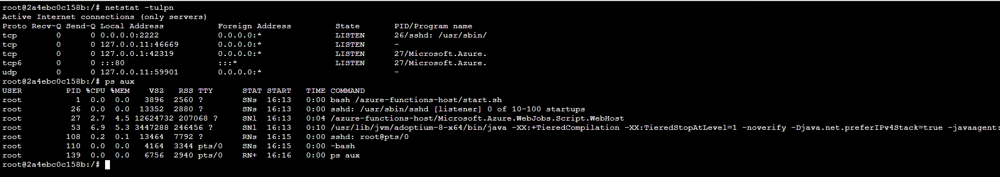

DOC: https://learn.microsoft.com/en-us/azure/azure-functions/functions-create-container-registry?tabs=acr%2Ccmd&pivots=programming-language-java

# build the image

docker build -t myimage .

# remove existing container names test, if any

docker rm -f test

# start the container

docker run -d -p 8080:80 -p 2222:2222 --name test myimage

# check the running containers

docker ps

# check the logs of the test container

docker logs test

# test ssh

# use Docker! as the pwd

ssh root@localhost -p 2222 -c aes128-cbc,3des-cbc

# test on azure function app

Go to: https://<your-webapp-name>.scm.azurewebsites.net/webssh/host

